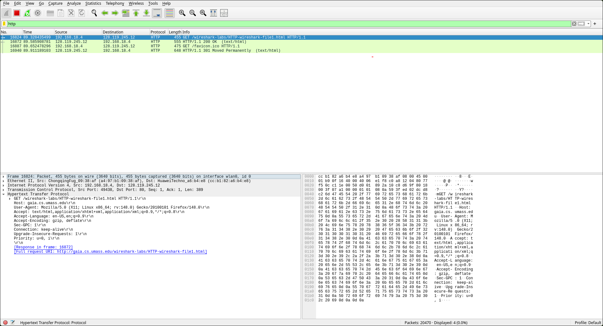

# Laporan Praktikum: Analisis Jaringan dengan Wireshark

Pada tutorial pekan 1, kita akan **menginstal dan menjalankan Wireshark.** Aplikasi ini memungkinkan kita untuk melakukan *capture paket data* yang sedang berjalan di jaringan yang sedang kita akses saat ini.


### Prerequisites
Sebelum terjun ke step-by-step, pastikan telah menyiapkan file berikut:

* **Wireshark**: Platform utama untuk menangkap dan menganalisis paket data.
* **Web Browser**: (Brave, Firefox, atau Chrome) Digunakan untuk membangkitkan traffic agar bisa di-capture.

* **Note : Saya menggunakan OS Linux, jadi langkah-langkah akan dilakukan berdasarkan environtment linux.**
---

### 1. Instalasi Wireshark

Buka terminal. Karena saya menggunakan basis Arch, kita akan menggunakan perintah pacman untuk menarik paketnya dari repositori.

Buka terminal Anda, lalu masukkan perintah berikut:
```bash
sudo pacman -S wireshark-qt
```

### 2. Konfigurasi Hak Akses (Rootless)

Masukkan baris perintah berikut di terminal untuk memberikan hak akses root di wireshark.

```bash
sudo usermod -aG wireshark $USER
sudo chgrp wireshark /usr/bin/dumpcap
sudo chmod 750 /usr/bin/dumpcap
sudo setcap 'CAP_NET_RAW+eip CAP_NET_ADMIN+eip' /usr/bin/dumpcap
```

### 3. Hasil dan Pengujian
Apabila semua berjalan sesuai harapan, Anda akan melihat barisan paket data yang muncul saat Anda membuka sebuah website. Inilah tampilan yang seharusnya Anda lihat:

