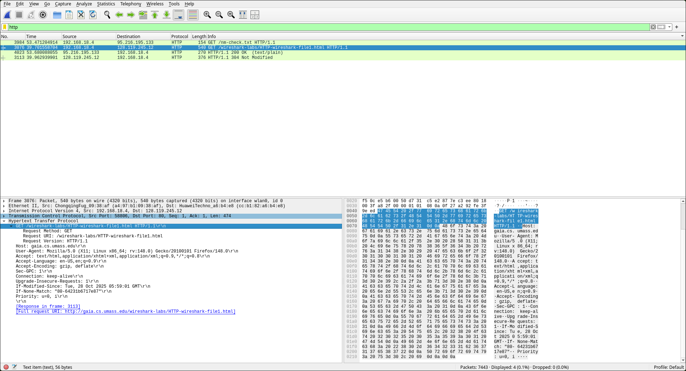
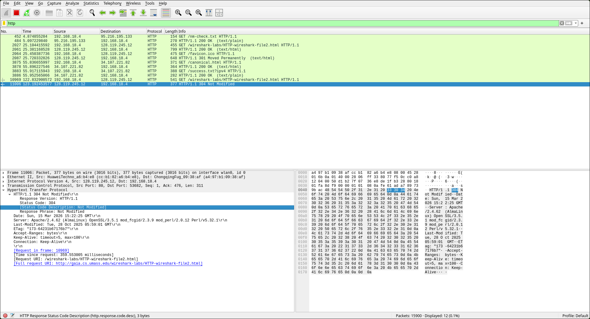
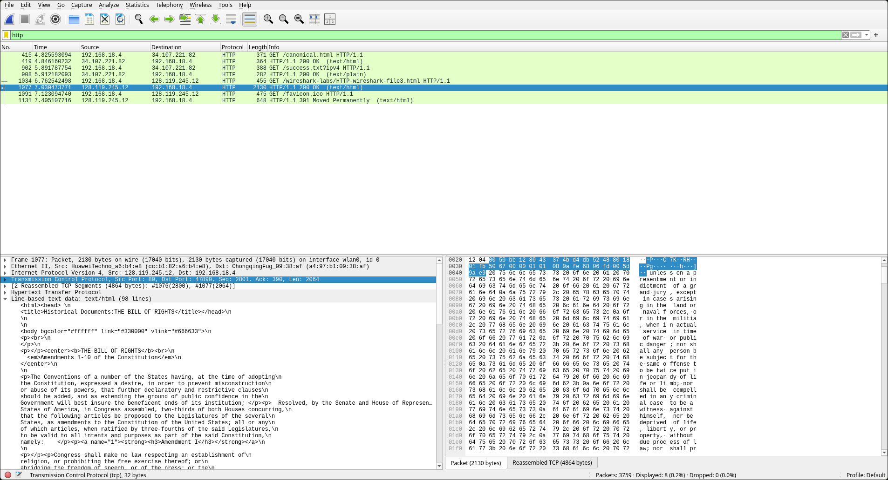
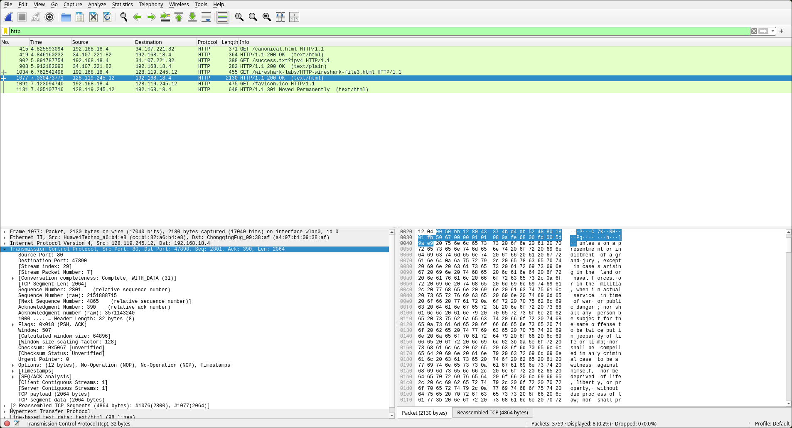
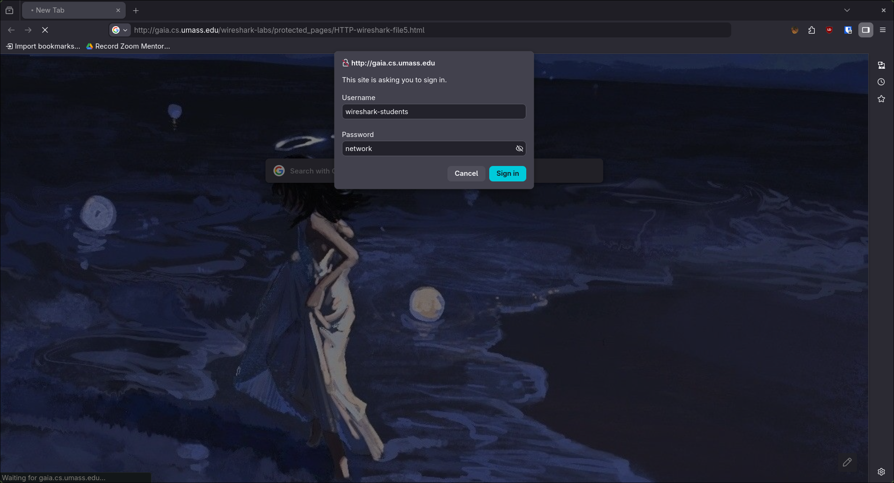
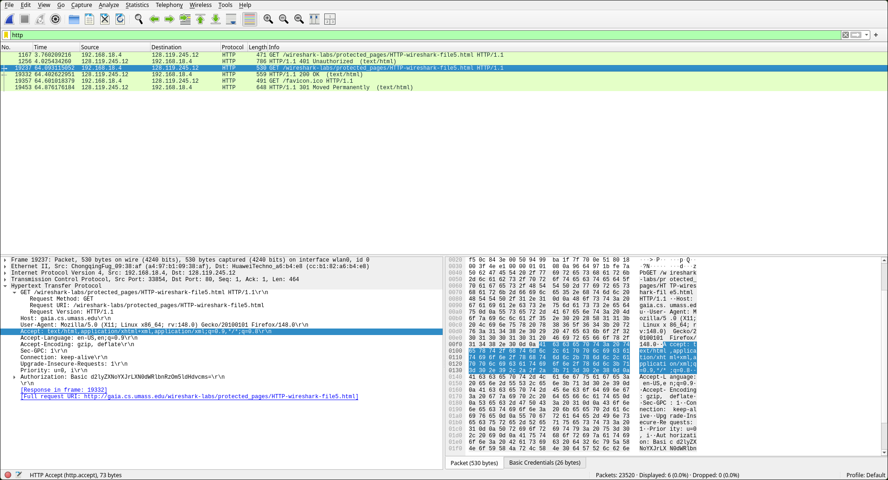

# Laporan Praktikum: Analisis Jaringan dengan Wireshark

Pada tutorial pekan ke-2, fokus praktikum adalah memahami fungsionalitas antarmuka Wireshark, menerapkan filter untuk menyaring data, dan menganalisis struktur paket data secara teknis.

### Prerequisites
Sebelum memulai proses analisis, pastikan komponen berikut telah siap:

* **Wireshark**: Platform utama untuk menangkap dan menganalisis paket data.
* **Web Browser**: (Brave, Firefox, atau Chrome) Digunakan untuk membangkitkan traffic  melalui protokol HTTP/HTTPS.

* **Note: Saya menggunakan OS Linux, sehingga seluruh konfigurasi dan perintah dilakukan dalam lingkungan terminal Linux.**

---

### 1. Interaksi Dasar HTTP GET/Response
Langkah ini bertujuan mengamati pertukaran pesan dasar antara klien dan server saat mengakses file HTML sederhana.

1. Jalankan Wireshark dan masukkan filter `http`.
2. Akses URL: `http://gaia.cs.umass.edu/wireshark-labs/HTTP-wireshark-file1.html`.
3. Analisis pada *packet-listing window* akan menunjukkan dua pesan utama:
   * **HTTP GET**: Permintaan dari browser Anda ke server.
   * **HTTP OK (200 OK)**: Respons dari server yang berisi data file.

  

### 2. Mekanisme HTTP Conditional GET
Fitur ini digunakan oleh browser untuk mengoptimalkan penggunaan *bandwidth* melalui *caching* objek.

1. Pastikan *cache* browser telah dibersihkan.
2. Akses URL: `http://gaia.cs.umass.edu/wireshark-labs/HTTP-wireshark-file2.html`.
3. Lakukan *refresh* atau akses kembali URL yang sama secara cepat.
4. Periksa pesan GET kedua di Wireshark. Anda akan menemukan field **"If-Modified-Since // 304 Not Modified"** pada header HTTP yang dikirimkan ke server untuk memverifikasi apakah objek telah berubah sejak akses terakhir.

  

  ### 3. Pengambilan Dokumen Panjang dan Segmentasi TCP
Saat dokumen yang diminta memiliki ukuran besar, data tersebut tidak dapat dimuat dalam satu paket tunggal dan harus melewati proses segmentasi di lapisan transport.

1. Akses dokumen berukuran panjang (±4500 byte) pada URL: `http://gaia.cs.umass.edu/wireshark-labs/HTTP-wireshark-file3.html`.
2. Karena ukuran file melebihi kapasitas beban maksimum, protokol TCP akan membagi data ke dalam beberapa segmen.
3. Pada Wireshark, segmen-segmen ini akan ditandai dengan keterangan **"[TCP segment of a reassembled PDU]"** pada kolom Info. Hal ini menunjukkan bahwa satu respons HTTP tunggal telah dipecah menjadi beberapa segmen TCP yang berbeda.

  

### 4. HTML Documents dengan Embedded Objects
Langkah ini menganalisis cara browser menangani file HTML yang mereferensikan objek lain, seperti gambar.

1. Akses URL: `http://gaia.cs.umass.edu/wireshark-labs/HTTP-wireshark-file4.html`.
* **Mekanisme**: File HTML dasar hanya mengandung URL referensi untuk gambar, bukan data gambarnya sendiri.
* **Proses**: Browser harus melakukan permintaan HTTP GET tambahan secara terpisah untuk mengambil setiap objek gambar yang disematkan dalam file HTML tersebut.

  

### 5. HTTP Authentication
Analisis ini dilakukan pada situs web yang memerlukan kredensial login (kata sandi).

1. Akses URL: `http://gaia.cs.umass.edu/wireshark-labs/protected_pages/HTTP-wireshark-file5.html`.
* **Akun**: Menggunakan username `wireshark-students` dan password `network`.
* **Format Pengiriman**: Kredensial dikirimkan dalam *header* `Authorization: Basic`.
* **Keamanan**: Data tersebut dikodekan menggunakan format **Base64**. Penting untuk dipahami bahwa Base64 bukan merupakan enkripsi dan dapat diterjemahkan kembali ke teks ASCII dengan mudah, sehingga transmisi ini tidak aman tanpa protokol tambahan.

  
  

---

### Kesimpulan
Di akhir pratikum Modul 3, kita sudah mempelajari HTTP dasar hingga Authentication. Berikut adalah rangkuman singkat dari langkah-langkah yang kita lakukan:

1. Protokol HTTP memanfaatkan metode GET untuk pengambilan data dan mendukung efisiensi melalui *conditional GET*.
2. Dokumen berukuran besar mengalami segmentasi pada lapisan TCP sebelum dikirimkan melalui jaringan.
3. Objek yang disematkan dalam HTML memerlukan permintaan terpisah oleh browser.
4. Autentikasi dasar HTTP menggunakan pengkodean Base64 yang tidak menyediakan keamanan kriptografi pada kredensial pengguna.