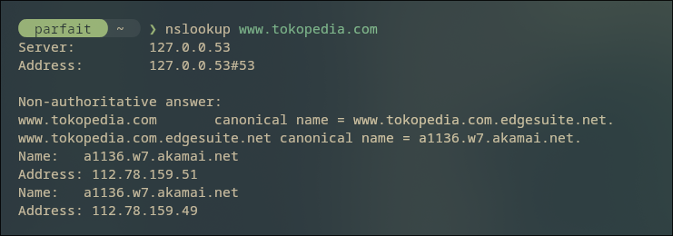
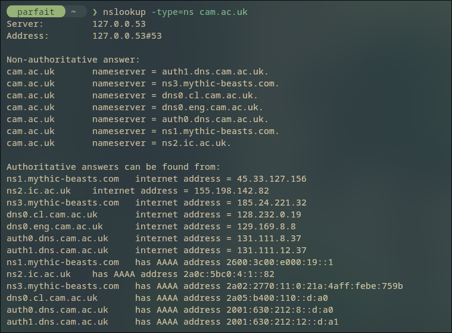
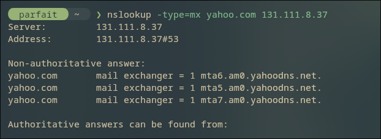
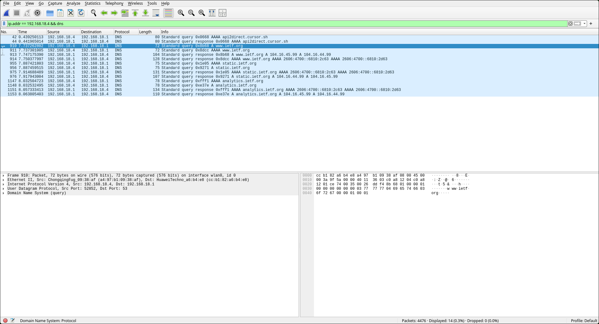
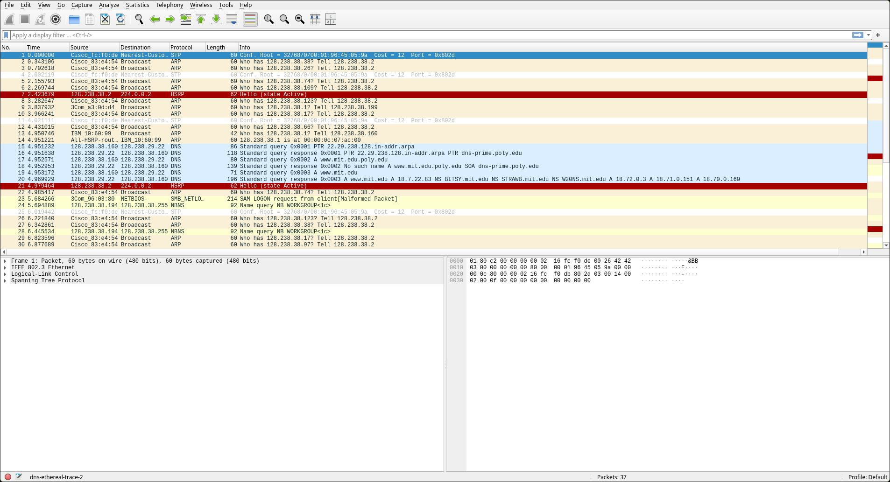
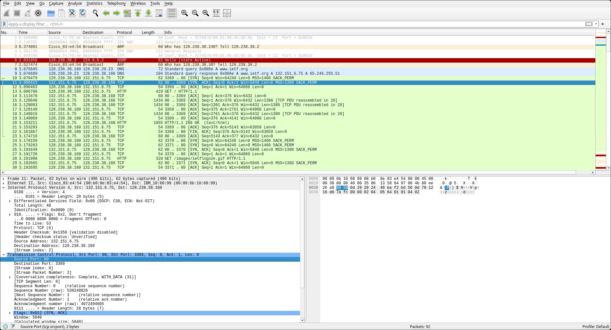
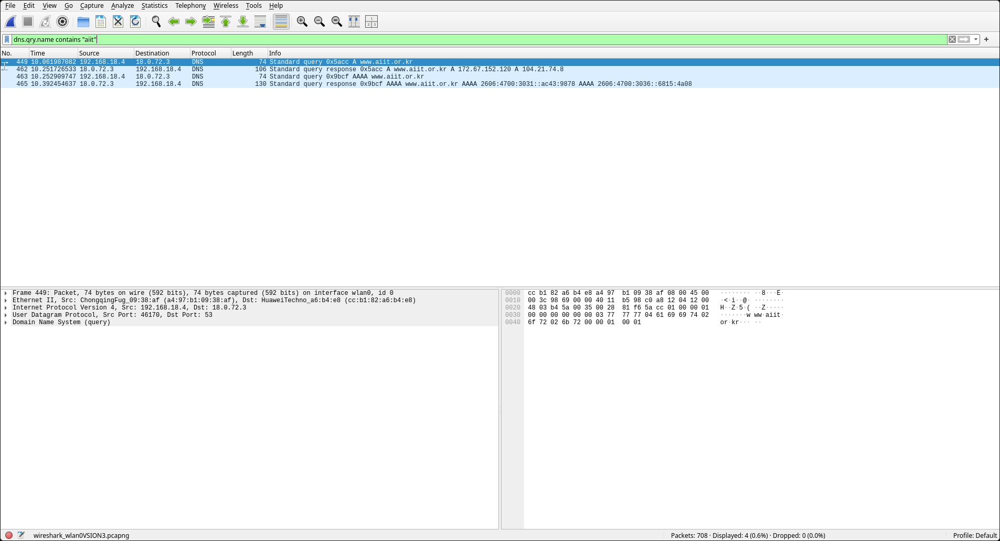

# Laporan Praktikum: Cara kerja DNS dengan Wireshark

Pada tutorial pekan ke-3, kita akan berfokus untuk menjawab serangkaian pertanyaan yang ada di Modul Pratikum.

### Prerequisites
Sebelum memulai proses analisis, pastikan komponen berikut telah siap:

* **Wireshark**: Platform utama untuk menangkap dan menganalisis paket data.
* **Web Browser**: (Brave, Firefox, atau Chrome) Digunakan untuk membangkitkan traffic  melalui protokol HTTP/HTTPS.
* **Terminal**: Cmd, Fish, Kitty, etc. Digunakan untuk memasukkan perintah kita.

* **Note: Saya menggunakan OS Linux, sehingga seluruh konfigurasi dan perintah dilakukan dalam lingkungan terminal Linux.**

---
## 4.2 Nslookup

#### 1. Berapa alamat IP server tersebut?

  

Berdasarkan hasil perintah `nslookup` pada domain **www.tokopedia.com**, ditemukan bahwa server tersebut memiliki dua alamat IP publik, yaitu:
1. **112.78.159.49**
2. **112.78.159.51**

Domain ini menggunakan CNAME yang mengarah ke layanan CDN Akamai (`a1136.w7.akamai.net`) untuk optimasi akses di wilayah Asia.

#### 2. Mencari tau server DNS otoritatif universitas di Eropa.

Untuk mengetahui server DNS otoritatif dari universitas di Eropa, kita bisa menggunakan parameter `type=ns` pada `nslookup`.

Daftar Server DNS Otoritatif.

Berdasarkan output yang dihasilkan, kita bisa melihat terdapat beberapa server DNS otoritatif untuk website Cambridge.

- `auth0.dns.cam.ac.uk`
- `auth1.dns.cam.ac.uk`
- `dns0.cl.cam.ac.uk`
- `dns0.eng.cam.ac.uk`
- dan lain-lainnya.

#### 3. Informasi server email dari Yahoo! Mail melalui server DNS Cambridge

Berdasarkan hasil perintah `nslookup -type=mx yahoo.com 131.111.8.37`, ditemukan bahwa Yahoo memiliki beberapa Mail Exchanger. Untuk mengetahui alamat IP-nya, dilakukan lookup lanjutan pada salah satu server tersebut (`mta6.am0.yahoodns.net`) dan didapatkan alamat IP: **[67.195.204.74]**.

## 4.4 Tracing DNS dengan Wireshark (Part A)

#### 1. Apakah pesan dikirimkan melalui UDP atau TCP?

Pesan dikirim melalui UDP, bisa dilihat melalui pada paket detail yang menunjukkan `User Datagram Protocol` pada paket nomor 910 (Query).

#### 2. Apa port tujuan pada pesan permintaan DNS? Apa port sumber pada pesan balasannya?

Berdasarkan detail paket:
- Port Tujuan pada Query: 53
- Port sumber: 52852

#### 3. Apa alamat IP tujuannya? Apa alamat IP server DNS lokal? apakah kedua alamat IP sama?

Berdasarkan detail paket
- Alamat IP Tujuan: 192.168.18.1
- Local DNS Server: Alamat IP tersebut sama dengan alamat IP dari local DNS server

Kesimpulan: Kedua alamat IP sama.

#### 4. "Type" pesan permintaan DNS dan isi jawaban

Pada pesan permintaan (Packet 910) untuk host www.ietf.org:
- Type: A, biasa digunakan untuk domain ke alamat IPv4
- Answers: Pesan tidak mengandung `answer` karena pesan hanya mengandung `Queries`.

#### 5. Jumlah "Answers" pada Pesan Balasan DNS

Pada pesan respon (Packet 913), ada 2 `Answer`.
- `www.ietf.org`: type A, class IN, addr 104.16.45.99
- `www.ietf.org`: type A, class IN, addr 104.16.44.99

#### 6. Kesesuaian IP pada Paket TCP SYN

Setelah proses DNS selesai, host akan mengirimkan paket TCP SYN untuk menginisialisasi koneksi HTTP/HTTPS.

Meskipun paket TCP tidak terlihat pada filter di gambar, secara protokol, alamat IP tujuan pada paket TCP SYN tersebut pasti sesuai dengan salah satu alamat IP yang diberikan dalam pesan balasan DNS (yaitu `104.16.45.99` atau `104.16.44.99`).

#### 7. Kebutuhan Pesan DNS Baru untuk Mengakses Gambar

Host tidak perlu mengirimkan pesan permintaan DNS baru setiap kali ingin mengakses gambar pada halaman web yang sama.

Hal ini dikarenakan adanya mekanisme DNS Caching. Setelah alamat IP dari `www.ietf.org` berhasil didapatkan, hasilnya akan disimpan di dalam cache lokal selama durasi tertentu yang ditentukan oleh nilai **TTL**. Selama data masih di cache, host akan langsung menggunakan IP tersebut tanpa kembali ke server DNS.

## 4.4 Tracing DNS dengan Wireshark (Part B)

Kali ini, saya akan menggunakan file `dns-ethereal-trace 2` untuk mempercepat proses.

#### 1. Port tujuan dan port sumber DNS

Berdasarkan analisis Query 10 dan respond nya 11:
- Port Tujuan: 53, DNS secara standar menggunakan port 53 untuk menerima permintaan.
- Port Respond: 53, DNS mengirimkan balasan dari port layanannya kembali ke port yang dibuka oleh host.

#### 2. Alamat IP tujuan dan Local DNS Server

- Alamat IP Tujuan: Pesan permintaan dikirimkan ke alamat IP `128.238.2.1`
- Local DNS Server: Iya, alamat IP tersebut merupakan default alamat IP server DNS lokal.

#### 3. "Type" pesan permintaan DNS dan isi jawaban

Pada pesan permintaan untuk host www.mit.edu:
- Type: A, biasa digunakan untuk domain ke alamat IPv4
- Answers: Pesan tidak mengandung `answer` karena pesan hanya mengandung `Queries`.

#### 4. Jumlah "Answers" pada Pesan Balasan DNS

Pada pesan respon `www.mit.edu`, hanya ada 1 `Answer`.
- `www.mit.edu`: type A, class IN, addr 18.7.22.83

#### 5. Screenshot bisa dilihat di atas.

## 4.4 Tracing DNS dengan Wireshark (Part C)

Kita akan tetap menggunakan file `dns-ethereal-trace 2` sebagai acuan, namun disini kita akan menambahkan kueri `nslookup -type=NS mit.edu`.

#### 1. Alamat IP tujuan dan Local DNS Server

- Alamat IP Tujuan: Pesan permintaan dikirimkan ke alamat IP `128.238.2.1`
- Local DNS Server: Iya, alamat IP tersebut merupakan default alamat IP server DNS lokal.

#### 2. "Type" pesan permintaan DNS dan isi jawaban

Pada pesan permintaan untuk host mit.edu dengan perintah `-type=NS`:
- Type: NS, biasa digunakan untuk domain ke nama server otoritatif.
- Answers: Pesan tidak mengandung `answer` karena pesan hanya mengandung `Queries`.

#### 3. Nama server MIT dan alamat IP-nya

Untuk mengetahui server DNS otoritatif dari server NUT , kita bisa menggunakan parameter `type=ns` pada `nslookup`.

Berdasarkan output yang dihasilkan, kita bisa melihat terdapat beberapa server DNS otoritatif untuk website Cambridge.

- `bitsy.mit.edu`
- `strawberry.mit.edu`
- `w20ns.mit.edu`

Alamat IP: Iya, pesan balasan juga memberikan alamat IP untuk server-server MIT tersebut.

#### 4. Screenshot bisa dilihat di atas.

## 4.4 Tracing DNS dengan Wireshark (Part D)

Di bagian terakhir, Kita akan mengganti metodenya ke **live capture** karena saya bosan. Disini kita akan menambahkan kueri `nslookup www.aiit.or.kr bitsy.mit.edu` sebagai kondisinya.

#### 1. Alamat IP tujuan dan Local DNS Server

- Alamat IP Tujuan: Pesan permintaan dikirimkan ke alamat IP `18.72.0.3`
- Local DNS Server: Tidak, karena alamat ini adalah IP milik server `bitsy.mit.edu`.

#### 2. "Type" pesan permintaan DNS dan isi jawaban

Pada pesan permintaan untuk host `www.aiit.or.kr`:
- Type: A, biasa digunakan untuk domain ke alamat IPv4
- Answers: Pesan tidak mengandung `answer` karena pesan hanya mengandung `Queries`.

#### 3. Jumlah "Answers" pada Pesan Balasan DNS

Pada pesan respon dari `bitsy.mit.edu`, ada 2 `Answer`.
- `www.aiit.or.kr`: type A, class IN, addr 172.67.152.120
- `www.aiit.or.kr`: type A, class IN, addr 104.21.74.8

#### 4. Screenshot bisa dilihat di atas.

---

### Kesimpulan
Di akhir pratikum Modul 4, kita sudah berhasil menjawab serangkaian pertanyaan yang telah diberikan. Berikut adalah rangkuman singkat dari langkah-langkah yang kita lakukan:

1. Protokol DNS beroperasi di atas protokol transport UDP menggunakan port 53 untuk proses kueri dan balasan.
2. Pesan permintaan hanya berisi bagian pertanyaan dengan jumlah jawaban nol, sedangkan informasi alamat IP atau resource records hanya ditemukan pada pesan balasan.
3. Record Type A digunakan untuk memetakan nama domain ke alamat IPv4, sementara Type NS berfungsi untuk mengidentifikasi nama server otoritatif yang bertanggung jawab atas suatu domain.
4. Proses resolusi DNS dapat dilakukan melalui local DNS server maupun kueri langsung ke server otoritatif, dengan efisiensi yang didukung oleh mekanisme caching berdasarkan nilai TTL.