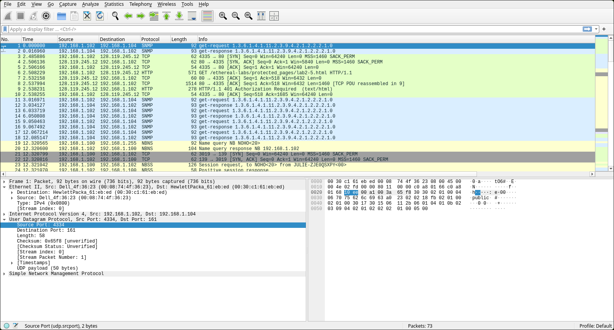

# Laporan Praktikum: Cara Kerja UDP dengan Wireshark

Pada tutorial pekan ke-4, kita akan berfokus untuk menjawab serangkaian pertanyaan yang ada di Modul Pratikum.

### Prerequisites
Sebelum memulai proses analisis, pastikan komponen berikut telah siap:

* **Wireshark**: Platform utama untuk menangkap dan menganalisis paket data.
* **Web Browser**: (Brave, Firefox, atau Chrome) Digunakan untuk membangkitkan traffic  melalui protokol HTTP/HTTPS.
* **Terminal**: Cmd, Fish, Kitty, etc. Digunakan untuk memasukkan perintah kita.

* **Note: Saya menggunakan OS Linux, sehingga seluruh konfigurasi dan perintah dilakukan dalam lingkungan terminal Linux.**
---

Di kesempatan kali ini, saya akan menggunakan file `http-ethereal-trace-5` dari folder wireshark yang sudah disediakan.

#### 1. Identifikasi FIeld pada Header UDP
Berdasarkan analisis pada paket UDP yang dipilih dari trace, terdapat 4 field utama yang menyusun header UDP.

Daftar field pada header UDP:
- Source Port: **4334**, Port asal yang digunakan oleh pengirim.
- Destination Port: **161**, Port tujuan yang digunakan oleh penerima.
- Length: Panjang total UDP
- Checksum: Digunakan untuk verifikasi integritas data.

#### 2. Panjang Byte Masing-masing Field
Berdasarkan **content field** pada paket tersebut, setiap field memiliki panjang:

- Source Port: **10 ee**, 2 byte.
- Destination Port: **00 al**, 2 byte.
- Length: **00 32**, 2 byte.
- Checksum: **d8 30**, 2 byte.

Dengan demikian, total panjang header UDP adalah 8 byte.

#### 3. Verifikasi Nilai pada Field Length
Nilai yang tertera pada `field Lenght` sudah memberi tau panjang total segmen UDP, yaitu **50**.

#### 4. Kapasitas Maksimum Payload UDP
`Field Length` memiliki ukuran 16 bit, nilai maksimum yang bisa ditampung adalah **65.535**. Maka, jumlah maksimum byte data yang bisa dikirimkan adalah:

`Total Max - Header -> 65.535 − 8 = 65.527 byte`

#### 5. Nomor Port Terbesar
Kita sudah mengetahui jawabannya melalui petunjuk `Field Length` yaitu 16 bit dengan nilai **65.535**.

#### 6. Nomor Protokol UDP pada Datagram IP
Untuk mengetahui nomor protokol, kita bisa membuka bagian "Internet Protocol" pada paket yang sama. Protokol UDP memiliki identitas sebagai berikut:
- Hexa: 0x11
- Desimal: 17

#### 7. Hubungan Nomor Port pada Pasangan Paket
Kita bisa mencari tahu hubungan port dengan cara memeriksa Request dan Reply pada *trace* tersebut:
- Host Pengirim: Source Port 4331, Destination Port 161
- Balasan: Source Port 161, Destination Port 4334

Nomor port pada kedua paket tersebut saling bertukar. Port tujuan pada paket pertama menjadi port sumber pada paket balasan, begitu pula sebaliknya.

---
### Kesimpulan
Di akhir praktikum Modul 5, kita sudah berhasil menjawab serangkaian pertanyaan mengenai mekanisme kerja protokol UDP melalui analisis packet trace. Berikut adalah rangkuman singkat dari hasil analisis yang telah dilakukan:

1. Header UDP memiliki struktur yang efisien dan sederhana dengan ukuran sebesar 8 byte dan terbagi menjadi empat field utama yang masing-masing berukuran 2 byte.
2. Nilai pada field Length merupakan representasi dari total panjang segmen UDP, sehingga kapasitas maksimum data yang dapat dimuat dalam satu datagram dibatasi oleh ukuran field.
3. Hubungan komunikasi antara host pengirim dan penerima pada protokol UDP menggunakan mekanisme bertukar posisi atau *port swapping* secara sistematis