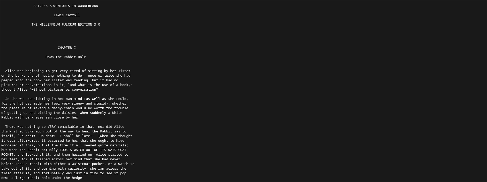
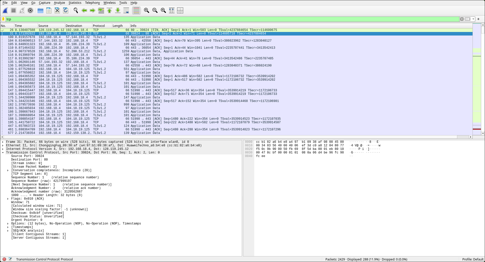
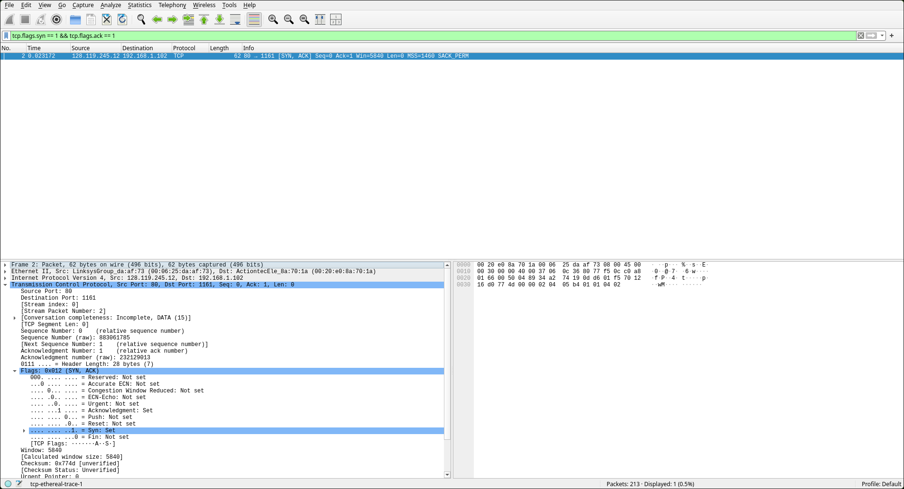
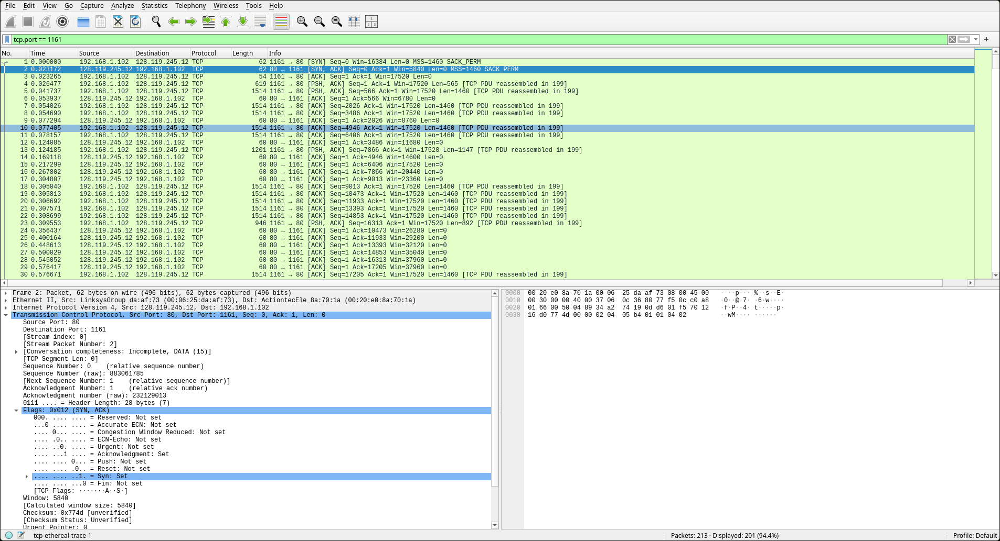
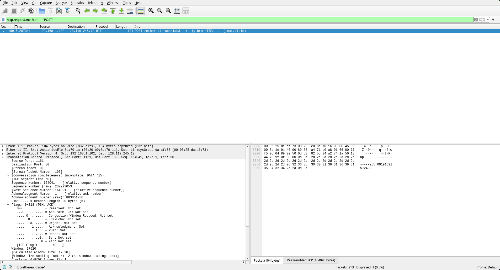
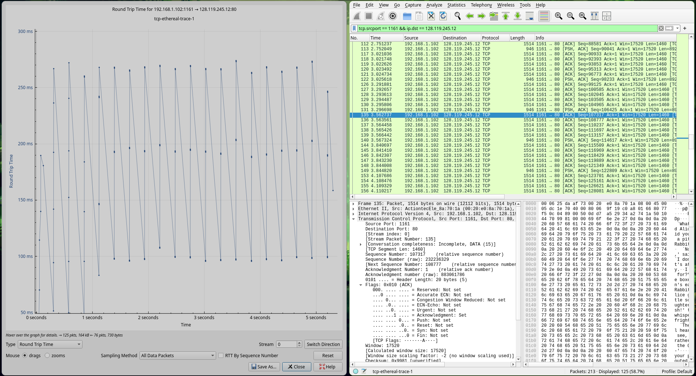
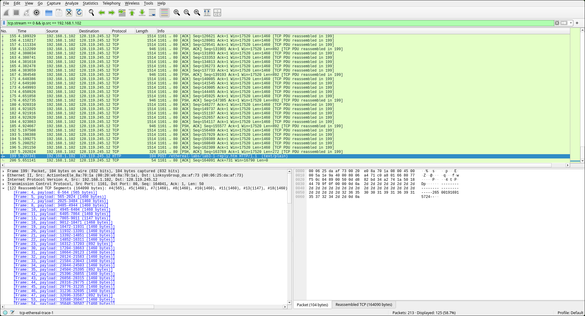
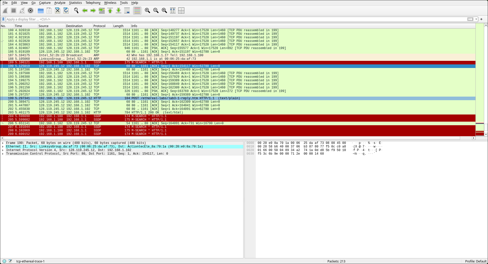
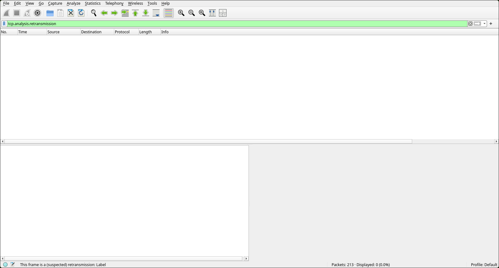
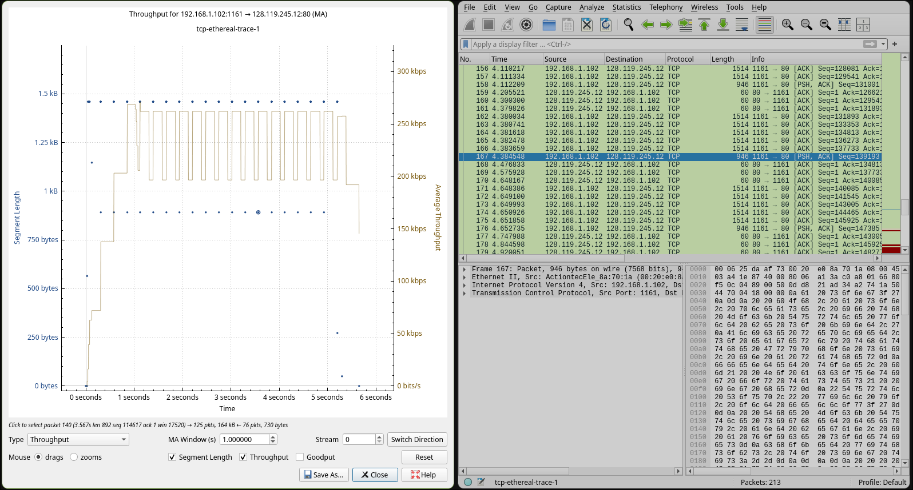

# Laporan Praktikum: Cara Kerja TCP dengan Wireshark

Pada tutorial pekan ke-5, kita akan berfokus untuk menjawab serangkaian pertanyaan yang ada di Modul Pratikum.

### Prerequisites
Sebelum memulai proses analisis, pastikan komponen berikut telah siap:

* **Wireshark**: Platform utama untuk menangkap dan menganalisis paket data.
* **Web Browser**: (Brave, Firefox, atau Chrome) Digunakan untuk membangkitkan traffic  melalui protokol HTTP/HTTPS.
* **Terminal**: Cmd, Fish, Kitty, etc. Digunakan untuk memasukkan perintah kita.

* **Note: Saya menggunakan OS Linux, sehingga seluruh konfigurasi dan perintah dilakukan dalam lingkungan terminal Linux.**
---
### Menangkap Transfer TCP dalam Jumlah Besar

1. Akses http://gaia.cs.umass.edu/wireshark-labs/alice.txt dan unduh script Alice in Wonderland. Simpan file tersebut dengan cara *Save page as...* dengan file txt.
2. Buka link http://gaia.cs.umass.edu/wireshark-labs/TCP-wireshark-file1.html, didalamnya akan muncul opsi **Browse** dan **Upload**.
3. Jangan lakukan tindakan dengan menekan tombol **Browse** maupun **Upload**, sebaiknya buka wireshark dan mulai capture.

4. Upload file alice.txt, jika berhasil maka contohnya seperti dibawah.

## Question Time!!!

#### 1. Identifikasi Alamat IP dan Port TCP
kita dapat melihat detail pada bagian Internet Protocol dan Transmission Control Protocol dari paket yang dikirimkan menuju server Gaia.

- Alamat IP Klien: 192.168.18.4
- Nomor Port TCP: 39824

#### 2. Identifikasi Alamat IP dan Nomor Port gaia.cs.umass.edu
Informasi server tujuan dapat ditemukan pada kolom Destination di header IP dan Destination Port pada header TCP.

Berdasarkan paket yang dianalisis, rincian server gaia.cs.umass.edu adalah sebagai berikut:
- Alamat IP Server: 128.119.245.12
- Nomor Port TCP: 80 (HTTP)

#### 3. Analisis Trace Mandiri: Alamat IP dan Port Sumber
Berdasarkan data yang tertangkap pada wireshark:
    - Alamat IP Klien: 192.168.18.4
    - Nomor Port TCP: 39824

## Dasar TCP

#### 1. Nomor urut segmen TCP SYN untuk memulai sambungan.

- Sequence Number: Nomor urut yang digunakan adalah 0.
- Identifikasi: Segmen ini diidentifikasi sebagai segmen SYN karena pada TCP Header Flags, bit Syn disetel ke nilai **1**, sementara bit Acknowledgement (ACK) bernilai **0**.

#### 2. Nomor urut dan nilai Acknowledgement pada segmen SYNACK.

- Sequence Number: Segmen SYNACK memiliki nomor urut 0.
- Nilai Acknowledgement: Nilai field ini adalah 1.
- Penentuan Nilai: Server menentukan nilai ini dengan mengambil **ISN** dari klien dan menambahkannya dengan 1 (0 + 1 = 1).
- Identifikasi: Segmen ini memiliki bit Syn dan bit Acknowledgement yang keduanya bernilai 1.

#### 3. Nomor urut segmen TCP yang berisi perintah HTTP POST.

Perintah POST merupakan bagian dari payload data pertama yang dikirimkan klien setelah three-way handshake.
Sequence Number: Nomor urut segmen yang berisi perintah POST adalah 1. Segmen ini juga ditandai dengan flag PSH (Push) untuk segera mengirimkan data ke aplikasi.

#### 4. Analisis RTT dan EstimatedRTT untuk enam segmen pertama.

Berikut adalah perhitungan waktu pengiriman, penerimaan ACK, dan nilai RTT untuk enam segmen data pertama:
- Data Segmen: Seq 1 (POST), 566, 2026, 3486, 4946, dan 6406.
- Waktu Kirim & ACK: Segmen pertama dikirim pada 0.0264s (ACK 0.0539s). Segmen keenam dikirim pada 0.0781s (ACK 0.1691s).
- Nilai RTT: Sample RTT bervariasi dari 0.027s hingga 0.091s.
- EstimatedRTT: Setelah pembaruan kumulatif untuk enam segmen, nilai akhirnya adalah 0.0506s. 

#### 5. Panjang (Length) dari enam segmen TCP pertama.

Berdasarkan kolom Length pada Wireshark untuk segmen yang dikirim klien:
- Segmen 1 (POST): 565 bytes.
- Segmen 2 - 6: Masing-masing memiliki panjang 1460 bytes.

#### 6. Kapasitas buffer penerima minimum.

Kita dapat melihat kapasitas buffer yang tersisa melalui field Win= pada paket yang dikirim oleh server (128.119.245.12).
- Ruang Buffer Minimum: Nilai terkecil yang terlihat pada awal trace adalah 5840 bytes (pada segmen SYNACK).
- Hambatan Pengiriman: Berdasarkan data, pengiriman tidak pernah terhambat oleh buffer penerima karena nilai Window Size terus meningkat seiring berjalannya transmisi.

#### 7. Segmen yang ditransmisikan ulang.

- Hasil Pemeriksaan: Tidak ditemukan adanya segmen yang ditransmisikan ulang dalam file trace ini.

#### 8. Data yang diakui dalam ACK.

- Jumlah Data Umum: Berdasarkan data pada paket #168 dan #169, penerima biasanya mengakui data sebesar 2920 bytes dalam satu ACK.
- Identifikasi: Angka 2920 bytes setara dengan dua segmen data. Sebagai contoh, paket ACK #169 (Ack=137733) mengakui data yang dikirim hingga akhir paket #166, yang berselisih 2920 bytes dari ACK sebelumnya pada paket #168 (Ack=134813).

#### 9. Perhitungan Throughput Sambungan TCP

Perhitungan *throughput* rata-rata dilakukan menggunakan rumus berikut:
$$\text{Throughput} = \frac{\text{Total Data Bytes}}{\text{Waktu Selesai} - \text{Waktu Mulai}}$$

* **Total Data:** Paket #199 memiliki **Seq=164041** dan **Len=50**, sehingga total data adalah **164.091 byte**
* **Durasi Waktu:** Dimulai dari paket SYN (0.000000) hingga ACK terakhir paket #202 (5.455830 detik).
* **Hasil:**
  $$\text{Throughput} = \frac{164.091 \text{ byte}}{5.455830 \text{ detik}} \approx 30.076 \text{ byte/detik}$$

---
### Kesimpulan
Di akhir praktikum Modul 6, kita sudah berhasil menjawab serangkaian pertanyaan mengenai mekanisme kerja protokol UDP melalui analisis packet trace. Berikut adalah rangkuman singkat dari hasil analisis yang telah dilakukan:

1. **Mekanisme Inisiasi dan Identifikasi Koneksi**: Analisis berhasil membedakan parameter koneksi antara klien dan server melalui mekanisme three-way handshake
2. **Keandalan dan Stabilitas Transmisi**: Protokol TCP menunjukkan performa yang signifikan dalam sesi ini, terbukti dengan tidak ditemukannya retransmission. Selain itu, stabilitas jaringan terlihat dari perhitungan EstimatedRTT yang mencapai nilai akhir 0.0506 detik untuk segmen-segmen awal dengan panjang data standar 1460 bytes.
3. **Efisiensi Transfer Data dan Throughput**: Transmisi data berlangsung efisien berkat pemanfaatan kapasitas buffer penerima yang memadai dan penggunaan mekanisme Delayed ACK yang mengakui data dalam jumlah besar sekaligus. Hal ini memungkinkan pencapaian nilai throughput rata-rata yang stabil di kisaran 250 kbps untuk total transfer data sebesar 164 KB.

